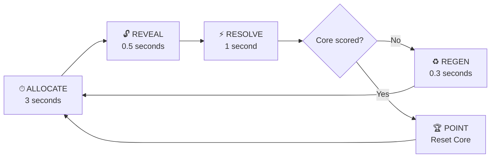
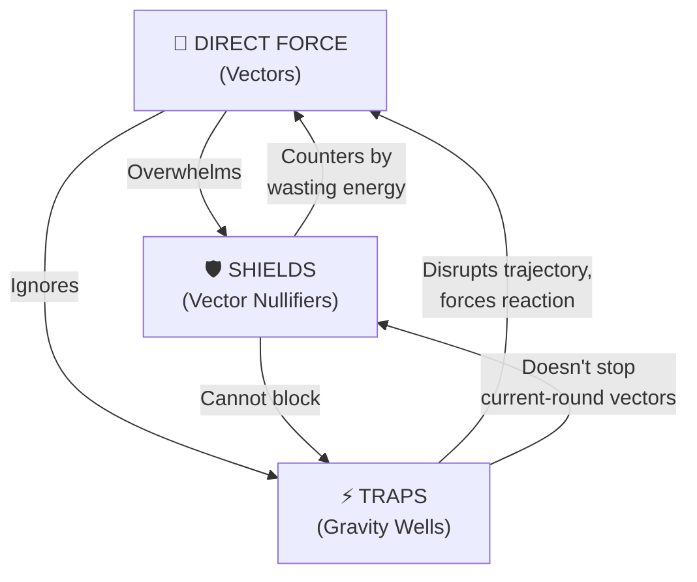
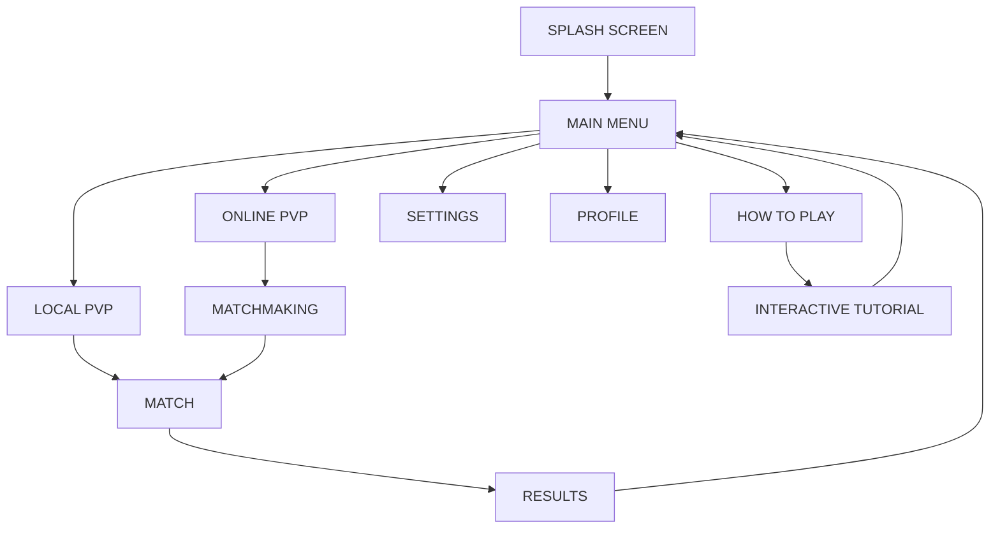

# TETHER — Game Design Document

> **Working Title:** TETHER  
> **Genre:** Arcade Strategy / Simultaneous-Action PvP  
> **Platform:** Android (touch-native)  
> **Players:** 2 (local same-device or low-latency network)  
> **Target Rating:** E (Everyone)  
> **Version:** 1.0 — February 2026

---

## Table of Contents

1. [High Concept](#1-high-concept)
2. [Design Pillars](#2-design-pillars)
3. [Core Loop](#3-core-loop)
4. [Detailed Mechanics](#4-detailed-mechanics)
5. [The Arena & Physics](#5-the-arena--physics)
6. [Energy System](#6-energy-system)
7. [Strategic Layer — Actions & Vectors](#7-strategic-layer--actions--vectors)
8. [Win Conditions & Scoring](#8-win-conditions--scoring)
9. [Controls & Input Design](#9-controls--input-design)
10. [Visual Design & Art Direction](#10-visual-design--art-direction)
11. [Audio Design](#11-audio-design)
12. [UI / UX Flow](#12-ui--ux-flow)
13. [Multiplayer Architecture](#13-multiplayer-architecture)
14. [Metagame & Progression](#14-metagame--progression)
15. [Monetization](#15-monetization)
16. [Accessibility](#16-accessibility)
17. [Technical Constraints](#17-technical-constraints)
18. [Risk Analysis](#18-risk-analysis)

---

## 1. High Concept

**TETHER** is a rapid-fire, best-of-N PvP arcade strategy game where two players fight to pull a floating geometric **Core** into their scoring zone by secretly allocating limited energy across competing force vectors — all within a brutal **3-second decision window**.

There are no health bars. No direct combat. Victory belongs to the player who outreads, outbluffs, and out-allocates their opponent across dozens of lightning-fast rounds.

> **One-Line Pitch:** *"Tug-of-war meets poker at 200 BPM."*

### Why It Works

| Player Need | TETHER's Answer |
|---|---|
| "I want a game I can play in 60 seconds." | A full match resolves in 60–90 seconds (15–25 rounds). |
| "I want something that rewards skill, not reflexes." | Prediction and resource-management outweigh twitch ability. |
| "I want meaningful PvP on mobile." | Simultaneous blind input removes turn-order advantage; touch-native controls. |

---

## 2. Design Pillars

### ⚡ Pillar 1 — Relentless Velocity
Every round resolves in under 5 seconds. Dead time (animations, transitions) is aggressively compressed. The game should feel like a heartbeat — INPUT → REVEAL → OUTCOME → INPUT.

### 🧠 Pillar 2 — Informed Bluffing
Players never see their opponent's current allocation. All strategy emerges from reading patterns, varying your own behavior, and managing imperfect information — akin to Rock-Paper-Scissors played at a PhD level.

### ◼ Pillar 3 — Radical Minimalism
The visual language is strictly geometric: circles, lines, triangles. No figurative art. High-contrast palettes (neon on black). Every pixel must serve gameplay legibility.

### ⚖ Pillar 4 — Accessible Depth
The input surface is a single screen with 3–4 drag targets. A new player understands the rules in one round. Mastery unfolds over thousands.

---

## 3. Core Loop



### Phase Breakdown

| Phase | Duration | Player Action |
|---|---|---|
| **ALLOCATE** | 3.0 s | Drag energy tokens onto vectors / traps / shields. Hidden from opponent. |
| **REVEAL** | 0.5 s | Both allocations displayed simultaneously with a dramatic flash. |
| **RESOLVE** | ~1.0 s | Physics engine applies forces; Core moves; traps trigger. |
| **REGEN** | 0.3 s | Energy partially regenerates. Score updated if Core enters a zone. |

**Total round time: ~4.8 seconds.** Target: 15–25 rounds per match.

---

## 4. Detailed Mechanics

### 4.1 The Core

- A **glowing hexagonal shape** floating at the center of the arena.
- Has **mass and inertia** — it doesn't teleport, it accelerates.
- Retains velocity between rounds (critical: momentum carries over).
- A thin **motion trail** shows its trajectory history.

### 4.2 Vectors (Force Tethers)

Each player controls **3 Vectors** — ethereal lines radiating from their side of the screen to the Core. Each vector represents a directional force axis.

```
         Player 2 Side
       ╱    |    ╲
     V2A   V2B   V2C       ← Player 2's 3 Vectors
       ╲    |    ╱
        [  CORE  ]
       ╱    |    ╲
     V1A   V1B   V1C       ← Player 1's 3 Vectors
       ╲    |    ╱
         Player 1 Side
```

**Vector Properties:**
- **Angle:** Fixed per vector, symmetrical between players.
  - Vector A: 45° left of center
  - Vector B: Straight (0°)
  - Vector C: 45° right of center
- **Force Magnitude:** Proportional to energy allocated.
- **Force Direction:** Always from Core toward the player's edge along the vector's angle.

### 4.3 Simultaneous Resolution

Both players' energy inputs are hidden during ALLOCATE. When the timer hits zero:

1. All allocations lock.
2. Reveal animation plays (both sides flash their vector intensities).
3. Net force is calculated: `F_net = Σ(Player1_vectors) + Σ(Player2_vectors)` (vector addition).
4. Core accelerates according to `F = ma` with damping.

> [!IMPORTANT]
> Because forces are **2D vectors**, not scalars, a player can win by attacking the *angle* their opponent neglects, not just the raw magnitude. This is the primary axis of strategic depth.

---

## 5. The Arena & Physics

### 5.1 Arena Layout

```
┌──────────────────────────────────┐
│          PLAYER 2 ZONE           │  ← Score zone (top 15%)
│ ─ ─ ─ ─ ─ ─ ─ ─ ─ ─ ─ ─ ─ ─ ─ │  ← Threshold line
│                                  │
│                                  │
│             [ CORE ]             │  ← Starting position
│                                  │
│                                  │
│ ─ ─ ─ ─ ─ ─ ─ ─ ─ ─ ─ ─ ─ ─ ─ │  ← Threshold line
│          PLAYER 1 ZONE           │  ← Score zone (bottom 15%)
└──────────────────────────────────┘
```

- **Dimensions:** Adaptive to screen size; 9:16 portrait orientation.
- **Scoring Zones:** Top and bottom 15% of the arena.
- **Side Walls:** Core bounces off side walls with 0.7 coefficient of restitution.
- **Center Line:** Visual only — no mechanical effect.

### 5.2 Physics Parameters

| Parameter | Value | Rationale |
|---|---|---|
| Core Mass | 1.0 (unit) | Baseline for force calculations. |
| Damping | 0.85 per round | Prevents runaway velocity; keeps Core "controllable." |
| Max Velocity | 30% arena-height / round | Prevents instant scores; preserves multi-round rallies. |
| Wall Bounce CoR | 0.7 | Bounces are punishing but not zero — side-angle play is viable. |
| Gravity | 0 | Purely player-driven forces. |

### 5.3 Momentum Carry-Over

The Core's velocity from round N persists into round N+1 (after damping). This means:

- A player who invests heavily in round N gains momentum advantage for round N+1.
- Coming back from behind requires overpowering both the opponent's allocation AND the Core's existing velocity.
- Creates natural "rallies" — back-and-forth momentum swings.

---

## 6. Energy System

### 6.1 Energy Pool

Each player has an **energy pool** of **10 units** (integer).

| Property | Value |
|---|---|
| **Max Energy** | 10 |
| **Starting Energy** | 10 (full) |
| **Regen per Round** | +3 |
| **Regen Cap** | 10 (cannot exceed max) |
| **Minimum Allocation** | 0 per vector |

### 6.2 Allocation Rules

- Energy is divided across **3 Vectors** + **1 Trap Slot** + **1 Shield Slot** = 5 possible targets.
- You can allocate 0 to any target (no minimum spend).
- Total allocated **must not exceed current energy**.
- **Unspent energy is NOT conserved** — you lose what you don't allocate. This forces commitment every round.

> [!CAUTION]
> "Use it or lose it" is a critical design choice. It prevents turtling (hoarding energy) and ensures every round has meaningful action.

### 6.3 Energy Visualization

Energy is displayed as a **segmented arc bar** on the player's edge of the screen. Each unit = one glowing segment. Depleted segments dim. Regenerated segments flash briefly on restore.

---

## 7. Strategic Layer — Actions & Vectors

### 7.1 The 5 Allocation Targets

| Target | Cost | Effect | Notes |
|---|---|---|---|
| **Vector A** | 1–10 | Applies force along 45° left axis | Magnitude scales linearly with energy. |
| **Vector B** | 1–10 | Applies force along 0° (center) axis | Strongest direct pull. |
| **Vector C** | 1–10 | Applies force along 45° right axis | Mirrors Vector A. |
| **Trap** | 3 (fixed) | Places a **Gravity Well** on the arena | Activates next round. Pulls Core toward a chosen point. |
| **Shield** | 2 (fixed) | Nullifies one opponent vector next round | Choose which enemy vector to cancel (A, B, or C). Blind pick. |

### 7.2 Traps: Gravity Wells

- **Cost:** 3 energy (fixed, non-variable).
- **Placement:** Player taps a location on the arena during ALLOCATE. A small gravitational anomaly appears there NEXT round.
- **Effect:** During the next RESOLVE, the Gravity Well exerts a constant pull on the Core toward its center (force = 2 energy-units equivalent).
- **Duration:** 1 round only; then dissipates.
- **Visibility:** Both players can see active Gravity Wells during ALLOCATE (they are public information once placed). Placement is secret, but the result is visible.
- **Limit:** Max 1 active Gravity Well per player at a time.

**Strategic Use:**
- Place wells near your scoring zone to create a "funnel."
- Place wells mid-field to disrupt predictable Core trajectories.
- Force opponent to spend energy countering the well instead of pulling.

### 7.3 Shields: Vector Nullifiers

- **Cost:** 2 energy (fixed).
- **Target:** Choose one of opponent's vectors (A, B, or C) to nullify.
- **Effect:** The targeted opponent vector's force is reduced to **zero** for the current round, *regardless* of how much energy they allocated to it.
- **Timing:** Resolves during the current round (not delayed like Traps).
- **Visibility:** Shield target is hidden during ALLOCATE; revealed during REVEAL.
- **Limit:** Max 1 shield per round.

**Strategic Use:**
- If opponent consistently funnels energy into Vector B, shield B to waste their energy.
- Costs only 2 energy — high ROI if you guess right.
- Creates a guessing game: opponent must vary allocation to avoid shields.

### 7.4 The Strategic Triangle

The interplay between direct force, traps, and shields creates a dynamic similar to extended RPS:



- **Heavy Direct** beats Shield (you have 2 more un-shielded vectors).
- **Shield** counters predictable single-vector focus (nullifies their biggest investment).
- **Trap** creates positional pressure that direct force must react to next round.
- **Spread Allocation** is safe but weak; **Concentrated Allocation** is strong but shieldable.

---

## 8. Win Conditions & Scoring

### 8.1 Match Structure

| Setting | Value |
|---|---|
| **Points to Win** | 5 |
| **Score Trigger** | Core fully enters opponent's scoring zone. |
| **Post-Score Reset** | Core returns to center. All velocity zeroed. Energy fully restored. |
| **Overtime** | If tied at 4-4, play until 2-point lead (deuce rules). |
| **Match Time Cap** | 3 minutes hard cap → highest score wins; if still tied, sudden death (first point wins). |

### 8.2 Scoring Moment

When the Core crosses the threshold into a scoring zone:
1. **Freeze** — 0.3s freeze frame.
2. **Flash** — The scoring zone bursts with the scorer's color.
3. **Score Counter** — Central score updates with punchy animation.
4. **Reset** — Core returns to center. Brief 1s breathing room.

### 8.3 Near-Miss Mechanic: "Graze"

If the Core enters the **outer 5%** of a scoring zone but doesn't fully cross:
- A **"GRAZE"** visual indicator flashes.
- No point is scored, but the near-miss is tracked.
- After 3 Grazes by the same player, they earn a **bonus energy** (+2 once).
- Rewards sustained pressure even without scoring.

---

## 9. Controls & Input Design

### 9.1 Layout (Portrait Mode, Same-Device)

```
┌──────────────────────────┐
│   P2 ENERGY BAR (top)    │  ← Inverted for P2
│   P2 INPUT ZONE          │
│  [Trap] [Shield] [A B C] │  ← P2's allocation targets
│ ── ── ── ── ── ── ── ── │
│                          │
│       [ GAME ARENA ]     │
│       [    CORE    ]     │
│                          │
│ ── ── ── ── ── ── ── ── │
│  [A B C] [Shield] [Trap] │  ← P1's allocation targets
│   P1 INPUT ZONE          │
│   P1 ENERGY BAR (bottom) │
└──────────────────────────┘
```

### 9.2 Input Mechanics

**Primary Input: Drag-to-Allocate**
- Each allocation target appears as a **circular well** on the player's edge.
- Player drags from their **energy bank** (the arc bar) toward a target well.
- The number of energy units allocated is determined by **drag distance / hold duration**:
  - Quick flick = 1 unit.
  - Full drag = up to remaining energy.
- A **radial fill indicator** shows current allocation per target in real time.
- Player can tap a target to remove energy (returns to pool).

**Trap Placement:**
- Tap the Trap icon → arena becomes tappable → tap location on arena to place.
- 3 energy auto-deducted.

**Shield Selection:**
- Tap the Shield icon → 3 buttons appear (A, B, C representing opponent's vectors) → tap to select.
- 2 energy auto-deducted.

### 9.3 Input Constraints

| Rule | Rationale |
|---|---|
| Timer is non-pausable. | Maintains arcade pressure. |
| If timer expires with unallocated energy, it is lost. | Prevents stalling. |
| No "undo" after timer. | Commitment is core to design. |
| Vibration on 1s remaining. | Haptic urgency cue. |
| Allocation changes are free during the 3s window. | Encourages deliberation within time pressure. |

### 9.4 Network PvP Layout

In network mode, each player sees a **full-screen** arena from their perspective:
- Their allocation targets at the bottom.
- Arena fills the middle.
- Opponent's last-round allocation shown as a ghost summary at the top (post-reveal only).

---

## 10. Visual Design & Art Direction

### 10.1 Guiding Aesthetic

**"Neon Blueprint"** — The game looks like a glowing schematic drawn on black graphing paper.

| Element | Treatment |
|---|---|
| **Background** | Pure black (#000000) with faint grid lines (#111111). |
| **Core** | Glowing white hexagon with soft bloom. Pulses gently at rest. |
| **Vectors (P1)** | Cyan (#00F0FF) — thin lines from player edge to Core. Brightness = energy allocated. |
| **Vectors (P2)** | Magenta (#FF00AA) — same treatment, opposing color. |
| **Scoring Zones** | Subtle gradient glow at arena edges in player colors. |
| **Traps** | Pulsing concentric circles in the placer's color. |
| **Shields** | Brief hexagonal barrier flash on resolution. |
| **Energy Bar** | Segmented arc — glowing when full, dim when spent. |
| **Timer** | Circular countdown ring around the Core. |

### 10.2 Color Palette

```
PRIMARY
├── Black (BG)       #000000
├── Dark Grid         #111111
├── White (Core)      #FFFFFF
├── Cyan (P1)         #00F0FF
├── Magenta (P2)      #FF00AA
│
ACCENTS
├── Gold (Score)      #FFD700
├── Red (Warning)     #FF3333
├── Green (Regen)     #33FF99
└── Dim Gray (UI)     #666666
```

### 10.3 Animation Priorities

| Animation | Priority | Target Duration |
|---|---|---|
| Core movement (physics) | Critical | 60 fps continuous |
| Vector intensity glow | High | Real-time during ALLOCATE |
| Reveal flash | High | 0.3s burst |
| Score explosion | Medium | 0.5s particle burst |
| Trap pulse | Medium | Looping 1s cycle |
| Energy regen fill | Low | 0.2s per segment |

### 10.4 Screen Shake & Juice

- **On Reveal:** Micro screen-shake (2px, 100ms) proportional to total force applied.
- **On Score:** Larger shake (5px, 200ms) + chromatic aberration flash.
- **On Shield Block:** Vector "shatters" with particle break effect.
- **On Trap Trigger:** Radial wave pulse from trap center.

---

## 11. Audio Design

### 11.1 Philosophy

Audio is **electronic, percussive, minimal** — synth stabs, not orchestral. Every sound should feel like a machine event.

### 11.2 Sound Effects

| Event | Sound Style | Duration |
|---|---|---|
| Round Start | Short ascending synth arp | 0.3s |
| Timer Tick (final 1s) | Staccato metronome tick | 0.1s × 3 |
| Energy Allocation | Soft "click-snap" per unit | 0.05s |
| Reveal | Heavy bass drum hit + reversed cymbal | 0.5s |
| Core Impact (force applied) | Distorted thud, pitch varies with force | 0.2s |
| Score | Ascending fanfare stab + sub-bass drop | 0.8s |
| Shield Block | Metallic "clang" + filter sweep | 0.3s |
| Trap Activate | Low warbling hum → snap | 0.4s |
| Graze | Quick high-pitched "ping" | 0.1s |
| Match Win | Extended synth chord swell | 1.5s |

### 11.3 Music

- **Menu:** Ambient electronic drone with subtle pulse.
- **In-Match:** No continuous music — sound design IS the soundtrack. The rhythm of rounds creates emergent musicality.
- **Post-Match:** Brief 4-bar victory/defeat motif (distinct per outcome).

---

## 12. UI / UX Flow

### 12.1 Screen Flow



### 12.2 Main Menu

- Full-black background.
- Game title "TETHER" rendered as thin geometric wireframe text, center-screen.
- Menu options appear as horizontal lines that expand on tap.
- No busy imagery — embraces the minimalist pillar.

### 12.3 Match HUD

On-screen during gameplay:

| Element | Position | Info Shown |
|---|---|---|
| **Score** | Top-center | "P1 [score] — [score] P2" |
| **Round Timer** | Around Core | 3s circular countdown |
| **Energy (P1)** | Bottom edge | Segmented arc, count |
| **Energy (P2)** | Top edge | Segmented arc, count |
| **Phase Label** | Center | "ALLOCATE" / "REVEAL" / brief flash only |
| **Trap Indicators** | Arena | Pulsing circles where traps are active |

### 12.4 Tutorial

An **interactive 5-round guided match** against a scripted AI:

1. **Round 1:** "Drag energy to Vector B to pull the Core." (Only B unlocked.)
2. **Round 2:** "Now try splitting between A and C." (All vectors unlocked.)
3. **Round 3:** "Place a Trap to redirect the Core." (Trap introduced.)
4. **Round 4:** "Use a Shield to block the opponent." (Shield introduced.)
5. **Round 5:** "Free round — use everything you've learned."

Total tutorial time: ~45 seconds. Skippable.

---

## 13. Multiplayer Architecture

### 13.1 Local Same-Device Mode

- **Input Isolation:** Screen split into two halves. Each player's allocation area only responds to touches within their zone. Multi-touch required.
- **Hidden Information:** During ALLOCATE, each player's target allocations use **blind fill indicators** — the opponent can see that energy is being allocated (the bar decreases) but NOT to which target. The specific target UI elements are obscured by a "fog" overlay on the opponent's half.
- **Anti-Screen-Peek:** Optional "privacy mode" rotates each player's input to a brief separate step (P1 allocates → screen blacks out → P2 allocates → reveal). Adds ~3s per round but solves screen-peeking.

### 13.2 Network PvP Mode

| Aspect | Design |
|---|---|
| **Protocol** | WebSocket over TLS for real-time; fallback to HTTP polling. |
| **Tick Model** | Lockstep — round doesn't resolve until both players' inputs are received by server. |
| **Input Payload** | `{vectorA: int, vectorB: int, vectorC: int, trap: {x,y}|null, shield: "A"|"B"|"C"|null}` — ~50 bytes. |
| **Timeout** | If a player doesn't submit in 4s (3s + 1s grace), auto-submit 0 allocation (forfeit round). |
| **Latency Target** | <100ms RTT for acceptable experience. |
| **Anti-Cheat** | Server-authoritative physics. Client sends inputs only; server resolves and broadcasts outcome. |
| **Reconnection** | 10s window to reconnect; game pauses. Beyond 10s, disconnected player forfeits match. |

### 13.3 Matchmaking

- **Casual Queue:** Random opponent, unranked.
- **Ranked Queue:** ELO-based (starting 1000). Seasonal resets.
- **Friend Challenge:** Share 4-character room code.
- **Queue Timeout:** 15s → offer AI opponent.

---

## 14. Metagame & Progression

### 14.1 Player Profile

| Element | Description |
|---|---|
| **Level** | XP earned per match (win: 100, loss: 40, per-round: 5). |
| **Rank** | Bronze → Silver → Gold → Platinum → Diamond → Tether Master. |
| **Stats** | Win rate, avg rounds/match, shield accuracy %, trap conversion %. |
| **Match History** | Last 20 matches with round-by-round replay data. |

### 14.2 Cosmetics (Unlockable)

All cosmetics are purely visual and confer no gameplay advantage.

| Category | Examples |
|---|---|
| **Core Skins** | Different geometric shapes (octagon, star, diamond) with unique glow effects. |
| **Vector Styles** | Dotted lines, double lines, particle trails, lightning bolts. |
| **Color Themes** | Alternative player color pairs (Teal/Orange, Violet/Gold, etc.). |
| **Arenas** | Background variations (circuit board grid, star field, concentric rings). |
| **Titles** | Displayed under player name ("The Architect," "Bluff King," "Momentum Rider"). |

### 14.3 Unlocking

- **Level Milestones:** Every 5 levels unlocks a cosmetic.
- **Achievement-Based:** E.g., "Block 50 vectors with shields" → unlock Shield cosmetic.
- **Seasonal Rewards:** Ranked season end distributes exclusive cosmetics by tier.

---

## 15. Monetization

### 15.1 Model: Free-to-Play, Cosmetic Only

> [!WARNING]
> Under no circumstances should any purchasable item provide a gameplay advantage. This is a competitive PvP game — pay-to-win would destroy it.

| Revenue Stream | Description |
|---|---|
| **Cosmetic Packs** | Bundles of core skins + vector styles + arena themes ($1.99–$4.99). |
| **Season Pass** | Unlock premium cosmetic track for current ranked season ($2.99). |
| **Ad-Supported Free** | Optional rewarded ads: watch ad → earn 2x XP for next match. |
| **Remove Ads** | One-time IAP to remove all ads ($3.99). |

---

## 16. Accessibility

| Feature | Implementation |
|---|---|
| **Colorblind Modes** | Deuteranopia, Protanopia, Tritanopia alternatives for all player colors. Uses pattern/shape differentiation in addition to color. |
| **Scalable UI** | All touch targets minimum 48dp. Energy bar text scales with system font size. |
| **Haptic Feedback** | All key events have vibration patterns (optional, configurable). |
| **Audio Cues** | Every visual event has a corresponding unique sound — game is playable with screen-reading assistance. |
| **Reduced Motion** | Option to disable screen shake, particle effects, and rapid animations. |
| **Timer Adjustment** | In casual/local mode, timer can be extended to 5s or 7s for accessibility. |
| **One-Handed Mode** | Simplified layout option — all allocation targets in a single vertical column on one side. |

---

## 17. Technical Constraints

### 17.1 Target Specifications

| Spec | Requirement |
|---|---|
| **Min Android Version** | API 26 (Android 8.0 Oreo) |
| **Target FPS** | 60 fps (physics & render) |
| **APK Size** | < 25 MB |
| **RAM Usage** | < 150 MB peak |
| **Battery** | < 5% per 30-min session |
| **Network** | < 1 KB/s average during network PvP |

### 17.2 Tech Stack (Recommended)

| Layer | Technology |
|---|---|
| **Engine** | Custom lightweight Canvas/WebGL renderer OR libGDX (if native) |
| **Physics** | Custom — simple 2D vector math, no heavy physics library needed |
| **Networking** | WebSocket (Socket.IO or raw) + Node.js relay server |
| **Data Storage** | SharedPreferences (local) + Firebase Firestore (cloud profiles) |
| **Auth** | Google Play Games Sign-In |
| **Analytics** | Firebase Analytics |
| **Build** | Gradle (Android Studio) or Capacitor (if web-based) |

### 17.3 Performance Budget per Frame (16ms)

| Task | Budget |
|---|---|
| Input processing | 1 ms |
| Physics step | 2 ms |
| AI (if applicable) | 3 ms |
| Render | 8 ms |
| Buffer | 2 ms |

---

## 18. Risk Analysis

| Risk | Likelihood | Impact | Mitigation |
|---|---|---|---|
| **"Solved" meta** — one dominant strategy emerges | Medium | High | Balance levers: vector angles, energy costs, shield/trap costs are all tunable. Plan for biweekly balance patches. Add 4th vector or new action types if needed. |
| **Screen-peeking in local mode** | High | Medium | Privacy mode (sequential input). Physical divider recommendation. Network mode as primary competitive mode. |
| **3-second timer feels too short** | Medium | Medium | Playtesting in casual mode with 5s/7s options. If consensus is too short, adjust to 4s baseline. |
| **Low player count for matchmaking** | High (at launch) | High | AI opponents with difficulty tiers. Local mode as primary mode at launch. Cross-promotion. |
| **Physics feels "random"** | Low | High | Deterministic physics (fixed-point math, no floating-point drift). Server-authoritative resolution. All parameters visible to both players. |
| **Touch input too fiddly** | Medium | High | Large touch targets (48dp+). Drag-based allocation with forgiving gesture detection. Extensive playtesting with diverse hand sizes. |

---

## Appendix A: Round Example (Annotated)

> **Scenario:** Score is P1: 2, P2: 3. Core has slight upward (P2-direction) momentum from last round. P1 has 7 energy, P2 has 6 energy.

**P1 thinks:** *"Core is already drifting toward P2's zone. If I support that drift, P2 might over-commit to defense. I'll spread my pull and set a trap for next round."*

**P1 allocates:** Vector A: 0, Vector B: 2, Vector C: 2, Trap: 3 (placed near P2 zone), Shield: none. (Total: 7)

**P2 thinks:** *"Core is coming my way — dangerous. I need to push it back hard. P1 probably expects me to go center, so I'll shield their B and push through A."*

**P2 allocates:** Vector A: 4, Vector B: 0, Vector C: 0, Trap: none, Shield: P1's B. (Total: 6)

**REVEAL:** Both inputs shown.

**RESOLVE:**
- P1's Vector B is shielded → nullified (P2 guessed right!).
- P1's effective force: Vector C only (2 units, angled right).
- P2's effective force: Vector A only (4 units, angled left).
- Net force pulls Core toward P2's left side. Existing upward momentum partially countered.
- Core drifts toward P2's zone at a diagonal but doesn't score.
- **P1's trap activates next round** near P2's zone — P2 will have to deal with it.

**REGEN:** P1 → 3+3 = 6 energy. P2 → 0+3 = 3 energy.

> P2 won the force battle this round but spent everything. P1's trap will shift the pressure next round, and P1 has double P2's energy. The game is far from decided.

---

## Appendix B: Balance Tuning Levers

These parameters should be surfaced in a developer-only debug menu for rapid iteration:

| Parameter | Default | Range | Effect of Increase |
|---|---|---|---|
| `MAX_ENERGY` | 10 | 6–15 | More allocation options → slower, more strategic. |
| `ENERGY_REGEN` | 3 | 1–5 | Faster regen → more aggression, less scarcity. |
| `ROUND_TIMER` | 3.0s | 2.0–7.0s | Longer → more deliberate; shorter → more instinct. |
| `CORE_MASS` | 1.0 | 0.5–3.0 | Heavier → more rallies, harder to score. |
| `CORE_DAMPING` | 0.85 | 0.5–1.0 | Lower → more momentum carry; higher → more reset to neutral. |
| `TRAP_COST` | 3 | 2–5 | Cheaper → more trap spam; expensive → more commitment. |
| `TRAP_FORCE` | 2.0 | 1.0–4.0 | Stronger → more disruptive. |
| `SHIELD_COST` | 2 | 1–4 | Cheaper → more shield usage, more guessing game. |
| `SCORE_THRESHOLD` | 15% | 10–25% | Larger zone → easier to score, shorter matches. |
| `VELOCITY_CAP` | 0.3 | 0.15–0.5 | Higher → more volatile Core movement. |

---

## Appendix C: AI Opponent Design (For Solo Practice / Queue Fallback)

### Difficulty Tiers

| Tier | Name | Behavior |
|---|---|---|
| **1** | "Echo" | Mirrors player's last allocation with 1-round delay. Predictable. |
| **2** | "Scatter" | Random allocation with slight bias toward center vector. |
| **3** | "Reader" | Tracks player patterns (last 5 rounds). Attempts counters. 60% accuracy. |
| **4** | "Oracle" | Optimal play via minimax on simplified game tree. Uses traps/shields. ~85% win rate vs. average players. |

AI opponents use the same input interface as humans — no information advantage.

---

> **End of Document**
>
> *TETHER — Game Design Document v1.0*
> *Confidential — For Development Team Use*
